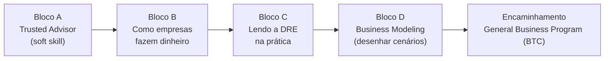

# Bootcamp Next Steps — Dia 1: NEGÓCIOS

> Índice geral: [ementa.md](ementa.md) · Fontes: doc de estrutura (Drive `1VYTvm3RaaMnujp2x1906QTAXtZ_r5HHTws0va3bVLMk`) + [transcrição do brainstorm de 29/ago](transcricao-brainstorm-2026-08-29.md).
> Itens não definidos = **TBD**.

| Campo | Conteúdo |
|---|---|
| Data | 04/09/2026 (sex) |
| Público | Toda a operação (obrigatório) |
| Responsáveis | Vitor Lauar, Erick Cardoso |
| Premissa da cadeira | Colaborador atua como **Consultor / Trusted Advisor** |
| Objetivo de aprendizagem | Entender o **modelo mental do negócio do cliente** (como faz dinheiro, o que trava o fluxo de receita) e saber conduzir uma conversa de DRE com o cliente |

---

## 1. Estrutura em blocos

## 2. Bloco A — Trusted Advisor (soft skill)

| Tópico | Detalhe |
|---|---|
| Curiosidade / interesse genuíno | É o skill que constrói repertório. Sem interesse intrínseco no sucesso financeiro do cliente, não há aprofundamento. |
| Analogia do "puzzle" | Entender como cada cliente faz dinheiro como um quebra-cabeça; comparar modelos parecidos que operam diferente. |
| Modelo do Trusted Advisor | Equação da confiança / *self-orientation*. Capítulos específicos: TBD. |
| Definição de problemas | Problem definition estruturada. |
| Escuta ativa | — |
| Vender ideias | Como tornar o cliente mais propenso a ouvir e aceitar propostas. |

## 3. Bloco B — Como as empresas fazem dinheiro (hard skill)

As 3 caixas de custo que todo negócio arbitra:

| Caixa | Sigla | Observação |
|---|---|---|
| Custo de servir | CMV / CSP | É do cliente; pouco manipulável pela V4 |
| Custo de vender | CAC | **Onde a V4 atua** — marketing digital dá previsibilidade e controle |
| Custos fixos | — | Baixo em negócio digital → modelo atrativo |

| Conceito | O que ensinar |
|---|---|
| Margem bruta | Definição simples |
| Breakeven | Quando (custo de servir + custo de vender) não deixam dinheiro para o custo fixo |
| Diagnóstico de gargalo | O custo de vender está alto vs. custo de servir? O conjunto não atinge o breakeven? |
| Teoria das Restrições | Qual a meta do negócio? Qual a restrição atual? Atuar sobre ela — no negócio **todo**, não só no funil de marketing |

> ⚠️ Ponto aberto (Vitor): o termo "Teoria das Restrições" confunde — as pessoas acham que sabem o que é. Avaliar renomear / reintroduzir com semântica própria. **TBD**.

## 4. Bloco C — Lendo a DRE na prática

| Tópico | O que ensinar |
|---|---|
| O que é uma DRE | De forma simples — o que cada "caixinha" significa e como achar problema nela |
| Perguntas-chave | As perguntas que se faz ao cliente para entender a DRE dele "como se estivesse conversando" |
| Fixos x variáveis | Ponteiros que se movem sem mexer em vendas: frete, meio de pagamento, fluxo de caixa |
| Língua do empresário | A maioria não é técnica — foco no modelo mental, não no jargão |

## 5. Bloco D — Business Modeling

| Tópico | O que ensinar |
|---|---|
| Desenhar cenários | Como entender de negócios e modelar cenários |
| Ler o modelo pelo tipo de negócio | Infoproduto → sem custo fixo relevante, custo só venda + mídia. Indústria/fábrica → custo fixo alto + custo de produção. Inferir margens/prioridades típicas. |
| Dependência do Bloco C | Entender a DRE é insumo para modelar cenários |

## 6. Encaminhamento / 80/20

| Item | Definição |
|---|---|
| Aprofundamento | **General Business Program (BTC)** fecha a lacuna de fundamentos. Alternativa: reverse engineering "na marra". |
| O que É o 80/20 do dia | Análise de demonstrações financeiras + business modeling simplificados |
| O que NÃO é | Matemática financeira detalhada (juros compostos etc.) |

## 7. Backlog de conclusão

Tarefas restantes para deixar o conteúdo de Negócios pronto para ser ensinado.

| # | Tarefa | Responsável | Status |
|---|---|---|---|
| 1 | Montar agenda hora a hora do dia | Vitor Lauar, Erick | TBD |
| 2 | Produzir materiais: slides, template de DRE, deck dos blocos A–D | TBD | TBD |
| 3 | Selecionar e escrever os estudos de caso (candidatos: Phenix, Ranaro, Jangada) | TBD | TBD |
| 4 | Desenhar o exercício prático / dinâmica de aplicação | TBD | TBD |
| 5 | Fechar a bibliografia (Trusted Advisor + módulos do General Business Program / BTC) | TBD | TBD |
| 6 | Decidir se "Teoria das Restrições" entra com esse nome ou é reintroduzida com outra semântica | Vitor Lauar, Erick | TBD |
