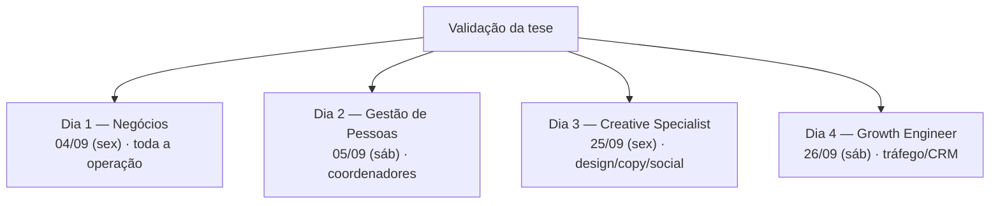

# Bootcamp Next Steps — Ementa (resumo geral)

> Fontes: (1) doc "Estrutura da imersão / pilares" — Drive `1VYTvm3RaaMnujp2x1906QTAXtZ_r5HHTws0va3bVLMk`; (2) Brainstorm Bootcamp Next Steps (29/ago/2026) — Drive `1JXhd-qkueWJeZVX3IUFQ-vQV6JHWDO_cnGzmKdjqHUY`, cópia local em [transcricao-brainstorm-2026-08-29.md](transcricao-brainstorm-2026-08-29.md).
> Este doc é o resumo. A ementa detalhada de cada dia está em arquivo próprio.

---

## 1. O que é o evento

| Campo | Definição |
|---|---|
| Objetivo | Treinar o time nas disciplinas chave para o negócio e para a **validação da tese** da unidade |
| Formato | 4 dias, divididos em 2 fins de semana (não fazer dias seguidos — "quebra a galera") |
| Pilares | Negócios · Gestão de Pessoas · Creative Specialist · Growth Engineer |
| Origem | Feedback do Ran (pouco tempo para discussão profunda) + necessidade de o time achar causa raiz real (unit economics) antes de plano de ação |

## 2. Estrutura dos 4 dias

| Dia | Pilar | Data | Público-alvo | Responsáveis | Obrigatório? | Ementa detalhada |
|---|---|---|---|---|---|---|
| 1 | Negócios | 04/09/2026 (sex) | Toda a operação | Vitor Lauar, Erick Cardoso | Sim | [dia-1-negocios.md](dia-1-negocios.md) |
| 2 | Gestão de Pessoas | 05/09/2026 (sáb) | Coordenadores | Erick Cardoso, Luana Martire, Ednaldo Colli, Carolina Colli | Sim (coord.) | [dia-2-gestao-de-pessoas.md](dia-2-gestao-de-pessoas.md) |
| 3 | Creative Specialist | 25/09/2026 (sex) | Designers, Copywriters, Socials, interessados | Vitor Neres, Larissa Idem, Leonardo Esteves | Não | [dia-3-creative-specialist.md](dia-3-creative-specialist.md) |
| 4 | Growth Engineer | 26/09/2026 (sáb) | Gestores de Tráfego, Analistas de CRM | João Pedro Moreira, Jean Reis, Robson Job, Luís Felipe Santos | Não | [dia-4-growth-engineer.md](dia-4-growth-engineer.md) |

> Datas conforme o doc de estrutura. As datas de 25–26/09 que o brainstorm de 29/ago cogitou para os dias 1 e 2 foram descartadas.

## 3. O que já está pronto

| Item | Estado |
|---|---|
| Objetivo e formato do evento | Definido |
| 4 pilares, público-alvo e datas | Definido |
| Responsáveis dos dias 1 e 2 | Definido |
| **Dia 1 — Negócios: conteúdo** | Definido em 4 blocos: (A) Trusted Advisor / curiosidade, (B) como as empresas fazem dinheiro — custo de servir / vender / fixo, margem, breakeven, teoria das restrições, (C) ler a DRE na prática, (D) business modeling. Encaminhamento: General Business Program (BTC). 80/20 = análise de DRE + modelagem simplificada, sem matemática financeira pesada. |
| Recorte do dia 1 | É para toda a operação, formato "eventão" |

## 4. O que precisa ser visto

### 4.1 Transversal (todos os dias)

| Pendência | Responsável | Status |
|---|---|---|
| Carga horária / agenda hora a hora de cada dia | — | TBD |
| Local e formato (presencial / híbrido / remoto) | — | TBD |
| Leitura prévia / pré-requisitos | — | TBD |
| Avaliação / certificação / follow-up pós-evento | — | TBD |
| Confirmar líderes das frentes 3 e 4 | Vitor Lauar, Erick | TBD |
| Produzir COP + LP + Copy do evento | O grupo | TBD |
| Publicar resumo e diretrizes no canal | Erick | TBD |

### 4.2 Por dia

| Dia | Conteúdo definido? | Principais pendências |
|---|---|---|
| 1 — Negócios | Sim (blocos A–D) | Agenda, materiais (slides, template de DRE), estudos de caso (Phenix / Ranaro / Jangada), exercício prático, bibliografia; decidir se "Teoria das Restrições" entra com esse nome |
| 2 — Gestão de Pessoas | Só títulos (Compliance, boas práticas, bibliografia, skills, indicadores) | Erick fecha o conteúdo na semana de 31/08–04/09; alinhar com a pauta que já corre com o Blind/People |
| 3 — Creative Specialist | Não | Confirmar líder; definir foco, objetivos, blocos soft/hard skill, agenda, materiais, exercícios; definir formato de convocação |
| 4 — Growth Engineer | Não | Confirmar líder; definir foco, objetivos, blocos soft/hard skill (tráfego e CRM), agenda, materiais, exercícios; escrever o recorte "Growth Engineer x Cientista/CRO" |
